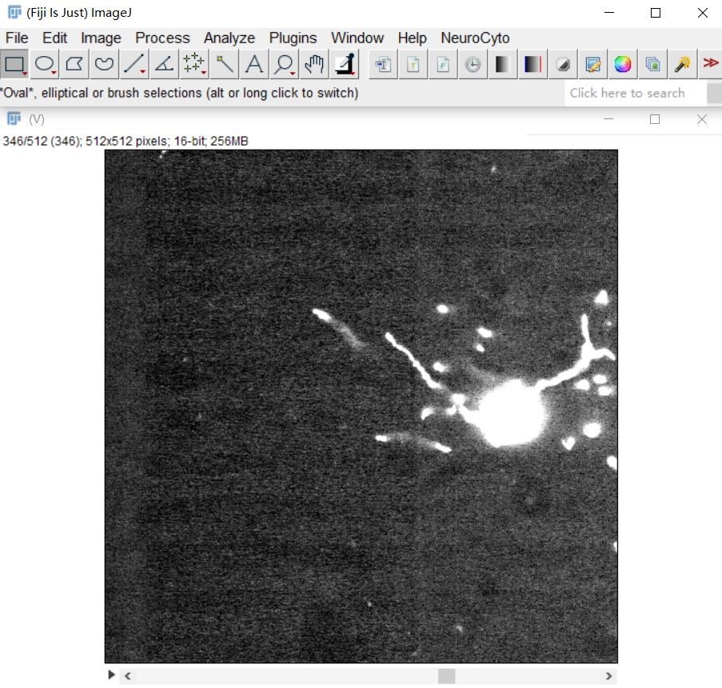

# BV-format-compatibility

## napari-BVdata

### Install:

1. Create a virtual environment. If you have a python environment with napari, you can activate the environment and skip this step.

   ``` python -m venv napari_env``` 

   ``` .\napari_env\Scripts\activate``` 

2. unzip */napari-BVdata/napari-BVdata/BVMoudle.zip directly .

3. cd */napari-BVdata and run following code in terminal:

   ``` python -m pip install -e .```

### Usage:

Run following code in terminal:

``` python script.py```


Click ```Load(napari-BVdata)``` in ```Plugins``` :


Click ```Browse``` to choose BV data in computer.  Input region of interests and scale level in ```Setting ROI```:


click ``` OK``` :


## Fiji-BVdata

### Install:

1. Create a virtual environment.

   ``` python -m venv fiji_env``` 

   ``` .\fiji_env\Scripts\activate``` 

2. cd */Fiji-BVdata and run following code in terminal:

   ```pip install -r requirements```

3. unzip Fiji-BVdata/BVMoudle.zip directly

4. Run following code in terminal:

   ``` python script.py```

   

## Usage:

Some parameters have to be set in script.py

` fiji_path(optional):  path for installed fiji.` 

`BV_config_path:       path for config file of BV data.`

`level:                scale level for loaded BV data.`

`{min_x, max_x, min_y, max_y, min_z, max_z}: parameters for ROI`


